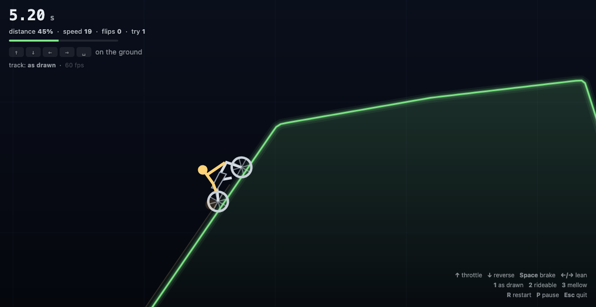
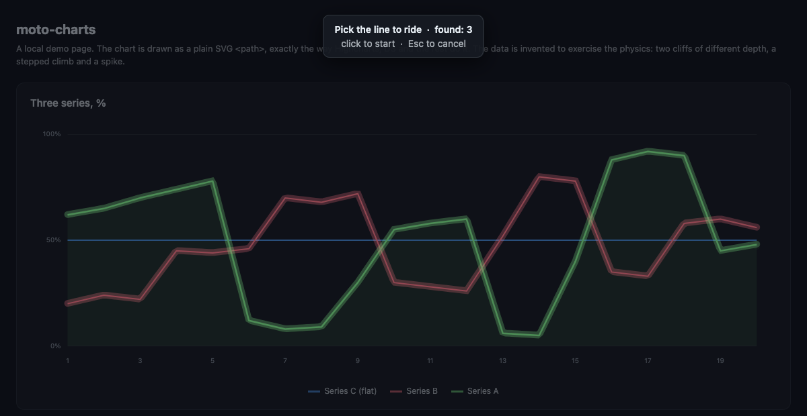

# moto-charts

Ride a motorbike over the line of any chart on the page — a physics trials game
played on your own data.



**[Try it in the browser](https://anrealm.github.io/moto-charts/)** — the demo page
runs the whole game against a chart drawn with plain SVG, no install needed.

The extension knows nothing about the charting library or its API. It takes the
line straight out of the DOM: finds `<path>`/`<polyline>` inside an `<svg>`,
samples it with `getPointAtLength()` and turns it into terrain. That works with
Highcharts, D3, ECharts, Plotly — anything that ends up as SVG — including
splines and stepped lines, because the `d` attribute is never parsed.

## Install

One MV3 codebase, built for both browsers. It declares `activeTab` and
`scripting` and no host permissions at all, so it can only reach a page in
response to you pressing the button or the shortcut.

### Firefox Developer Edition — permanent

1. `about:config` → set `xpinstall.signatures.required` to **false**
   (release Firefox ignores this switch — see below).
2. `about:addons` → gear → **Install Add-on From File** → `dist/moto-charts.xpi`.

### Release Firefox — temporary, until restart

Release Firefox only installs signed extensions, so an unsigned `.xpi` cannot be
installed permanently. What works:

`about:debugging#/runtime/this-firefox` → **Load Temporary Add-on** → pick
`dist/extension-firefox/manifest.json`.

Fully functional, but gone after a browser restart. The only route to a permanent
install on release Firefox is signing the build on addons.mozilla.org — an
"unlisted" signature works and does not publish the add-on to the directory.

### Chrome / Chromium — permanent

`chrome://extensions` → **Developer mode** → **Load unpacked** →
the `dist/extension-chrome/` folder.

### No install — bookmarklet

`dist/bookmarklet.txt` is a single `javascript:` line. Create a bookmark and
paste it into the URL field. The whole program lives inside the bookmark (~90 KB)
because an external `<script src>` would be blocked by the page's CSP, while a
bookmarklet runs with the page's own privileges.

`dist/moto.bundle.js` pasted into the devtools console does the same; the bundle
calls `MotoCharts.start()` itself.

## Playing

The page dims and every candidate line is highlighted — click the one you want
to ride.



| Key | Action |
|---|---|
| `↑` / `W` | throttle |
| `↓` / `S` | reverse |
| `Space` / `Shift` | brake |
| `←` / `A` | lean back (wheelie) |
| `→` / `D` | lean forward |
| `1` `2` `3` | track mode, see below |
| `R` | restart |
| `P` | pause |
| `Esc` | quit; the page is left exactly as it was |

Every letter key also answers on a Cyrillic layout (`ц ы ф в к з`), so the
controls work without switching layouts.

Touching the ground with the rider's head is a crash. Best lap times go to
`localStorage`, kept separately per line, per page and per mode. Switching mode
mid-ride restarts the run.

The throttle only bites while the rear wheel is on the ground — airborne it does
nothing. The HUD says so outright ("airborne — throttle does nothing"), because a
dead key otherwise reads as a bug.

## Track modes

Switchable mid-ride with <kbd>1</kbd>/<kbd>2</kbd>/<kbd>3</kbd>; the choice is
remembered. Best times are per mode: a lap over flattened terrain is not
comparable to one over 1:1 geometry.

| | what it does | the price |
|---|---|---|
| **1 · as drawn** | uniform scale, every angle exactly as the chart drew it; only climbs above 2.4 are capped | **not every chart can be completed** — that is an accepted outcome |
| **2 · rideable** | climbs are cut back just enough for the track to be completable; drops are untouched | some climbs are gentler than the original |
| **3 · mellow** | stretched horizontally and smoothed | only the silhouette of the chart survives |

Measured on the demo's cliff-heavy series — mean deviation of the terrain from
the chart line, as a share of its amplitude: **as drawn 0.2%**, rideable 5.2%,
mellow 36.2%.

The asymmetry is deliberate: **climbs and descents are capped differently.** You
can fall off a cliff — that is a flight and a trick; you can only stall against a
wall. Climbs get a tight ceiling; descents get a loose one (4.0, about 76°) that
exists only to keep the terrain a function of x rather than an overhang.

## Tricks

A flip counts when a full rotation is completed in the air and the bike lands it.
That needs both height and rotation speed, so it depends on the mode:

| mode | longest flight | rotations in it |
|---|---|---|
| as drawn | ~1.2 s | ~1.4 |
| rideable | ~1.2 s | ~1.4 |
| mellow | ~0.9 s | ~1.0 |

Approximate on purpose: the best a rider can wring out of a jump depends on how
they play it, and sweeping a handful of input policies moves these by several
tenths. Read them as "a flip fits, with less margin on mellow", not as records.
A flatter chart gives less height and can put a flip out of reach entirely.

How it is scored: rotation accumulates **only while genuinely airborne**, and the
trick is banked once the bike has stayed down longer than `contactGrace` (0.09 s)
without crashing. The threshold is 0.92 of a turn rather than a strict 1.0 — a
bike leaving a down-slope and landing on an up-slope reads as a full rotation to
the player while measuring a few degrees short.

`contactGrace` exists because of a subtler problem: resetting the accumulated
rotation on **any** ground contact. Contact is not a rare event — the bike grazes
the slope repeatedly on steep descents, dozens of times per run on the demo track
and far more on a cliffier one — and the counter used to be cleared on every one
of them, so completed flips scored nothing.

Scoring lives in `src/physics.js` rather than in the game layer, which is what
makes it unit-testable.

## Why a chart is rideable at all

Real charts contain near-vertical cliffs — a metric falling from its plateau to
zero within one day. Those cannot be ridden; the bike stalls against them. So the
line goes through a pipeline (`buildTrack`) first:

1. **longestRun** — the longest stretch of strictly increasing `x`. Area series
   are drawn as a closed path, and without this the baseline would be folded into
   the terrain.
2. **scaleTrack** — uniform scaling, both axes by the same factor, so every angle
   survives. (A horizontal-only stretch is available and is what "mellow" uses:
   it divides every gradient by the stretch factor, so at 3.5 a 79° cliff — a
   gradient of 5.1 — becomes a gradient of 1.5, or 56°.)
3. **smooth** — light smoothing so wheels do not catch on vertices.
4. **limitSlope** — separate ceilings for climbs and descents.
5. **withAprons** — flat run-up and landing strip at the ends.

In "rideable" mode the ceiling is not a constant: `autoTune` builds the track at
each climb cap from 2.4 down to 0.5, runs an autopilot over every candidate and
keeps **the steepest one the autopilot actually completes**, which preserves as
much of the original shape as possible. It costs a few milliseconds.

How steep a climb is possible at all is bounded by engine force, not geometry: at
1400 the autotuner settled at 0.66, at 2000 it reaches 1.2 (50°). Top speed on the
flat is unaffected either way — 903 against 906 px/s — because it is pinned by the
`maxSpeed` clamp well before drag would matter. Hence 2000.

## Where the track colour comes from

The terrain is painted in the source line's colour, but charts specify that
colour in several ways and not all of them mean anything to a canvas.
`resolveColor` tries, in order:

| how it is specified | what happens |
|---|---|
| `stroke: rgb(...)` / `#hex` | used as is |
| `stroke="url(#gradient)"` | first `<stop>` of the gradient, following one `href` hop |
| `stroke: currentColor` | the element's `color` |
| `stroke: none` with a fill | the `fill` |
| a fully transparent colour | treated as no colour, falls back to the default |

A paint-server reference cannot simply be handed to `strokeStyle`: the canvas
silently keeps the previous colour and the line comes out grey. All cases are
covered by `test/color-cases.html`.

## Performance

Lag that scales with window size means the frame cost is driven by area.
Measured on a 3840×2160 canvas (a 1920×1080 window on a retina display), against
a 16.7 ms budget for 60 fps:

| operation | ms/frame |
|---|---|
| line with `shadowBlur: 12` | **22.85** (137% of budget) |
| same line without `shadowBlur` | 1.25 |
| gradient fill under the line | 5.42 |
| HUD rebuilt via `innerHTML` every frame | 0.03 |

`shadowBlur` is priced by blur area, which is exactly why the lag tracked window
size. The glow is now a stack of translucent strokes under the solid line —
widths 20/12/6 px, alpha rising 0.07/0.13/0.26 as they narrow — which approximates
the same gaussian falloff for 0.02 ms: 4.22 ms/frame with the stack against 4.20
without it.

Full game render at that size: **4.22 ms**, down from ~28 ms. Two changes account
for nearly all of it — dropping `shadowBlur`, and moving the background gradient
from a per-frame `fillRect` to static CSS.

Three things the measurements ruled out, each of which looks like an obvious
optimisation:

* Rebuilding the HUD with `innerHTML` 60 times a second costs 0.03 ms.
* Moving to `Path2D` gains nothing by itself (1.20 vs 1.25 ms). Its only value is
  that one cached path can be stroked repeatedly for the glow without re-tracing.
* Dropping the glow when frames get slow is pointless — 4.22 ms with it against
  4.20 ms without is measurement noise. Automatic quality reduction lowers
  resolution first and only touches the glow as a last resort.

The backing store is also capped (`pixelBudget`, 4.2M pixels — counted as CSS
pixels times `devicePixelRatio` squared). A 2560×1440 window at `devicePixelRatio`
2 asks for 14.7M pixels per frame, which buys nothing visible.
Below ~45 fps the engine lowers resolution on its own; current fps and the
resolution multiplier are shown in the HUD.

Reproduce the measurements:

```bash
open "index.html?perf=1"      # the real render loop at 3840×2160
open "test/bench.html"        # individual canvas operations
```

## Development

No dependencies, no build tooling beyond a shell script.

```bash
node --test test/physics.test.mjs test/sandbox.test.mjs   # 30 tests
./build.sh                  # src/ + extension/ -> dist/
tools/check-dist.sh         # check what the build produced
node tools/make-icons.js    # redraw icons (only when the artwork changes)
open index.html             # local demo page with an SVG chart
```

`dist/` is generated from `src/` and `extension/` — do not edit it by hand.

### Releasing

Two workflows in `.github/workflows/`, both dependency-free — they run the same
three commands as above:

* `ci.yml` — tests, build and `tools/check-dist.sh` on every push to `main` and
  every PR. The built `dist/` is uploaded as a workflow artifact, so a branch can
  be installed and ridden without building it locally. An artifact from someone
  else's pull request is that pull request's code, packaged as an installable
  extension with `activeTab` and `scripting` — read the diff before installing it
  into a browser you use.
* `release.yml` — on a `v*.*.*` tag, builds from the tagged commit and attaches
  `moto-charts.xpi`, `moto-charts-chrome.zip`, `moto.bundle.js` and
  `bookmarklet.txt` to that tag's release. It also pins the manifests to the tag,
  so a forgotten version bump fails the release instead of shipping.

The workflow writes no release notes and publishes nothing, which makes the order
matter. **Push the tag first.** The build runs against it and leaves a draft
release with the assets already attached; open that draft, write the notes,
publish. If a check fails, nothing is public and the tag can be deleted and
re-pushed. Publishing the release first inverts this: the release is public
before the checks run, so a forgotten version bump leaves published notes
pointing at downloads that are not there, behind a tag that should not be moved.

If an upload fails on a tag that is already public, the workflow can be re-run
from the Actions tab against that tag rather than moving it. `v1.0.0` and
`v1.0.1` predate the workflow and their assets were uploaded by hand.

`tools/check-dist.sh` covers what a directory listing cannot: both archives open
as zips, the two manifests agree on a version, the bundle contains both sources
and ends with the call that starts the game, `MotoCharts.version` in `src/game.js`
— a third version string, shipped inside all four artifacts — matches the
manifests, and the bookmarklet still decodes to exactly the bundle it was built
from.

What is inside each archive is checked by `tools/check-archive.mjs`, against the
artifact rather than against a list. The manifest names the background scripts,
the popup and the icons; the popup names its scripts; `launcher.js` names the
files it injects into the page — every path any of them mentions has to be in the
zip. Deriving it that way is the point: a list of filenames kept in the checker
would drift along with the one in `build.sh`, and two lists that drift together
verify nothing. Names alone are not enough either, since a zip can carry
`content/game.js` as zero bytes or as last week's copy and still list every
expected entry — so every member must also be non-empty and byte-identical to the
file in the repo it was copied from. That is the claim a release makes about an
asset, checked. It also pins each tree to its own manifest (Firefox
`background.scripts` vs Chrome `background.service_worker` — swap them and the
extension installs, then does nothing), and rejects the `__MACOSX` and
`.DS_Store` entries a Finder-compressed archive carries.

* `src/physics.js` — terrain, track pipeline, bike physics. DOM-free, so it runs
  under node.
* `src/game.js` — line discovery, picker, rendering, input.
* `extension/` — the shell: popup, shortcut, injection. Two manifests,
  `manifest.firefox.json` (background scripts) and `manifest.chrome.json`
  (service worker); everything else is shared.
* `tools/make-icons.js` — draws the icons as PNGs with no dependencies, using a
  minimal PNG encoder over the built-in zlib.
* `index.html` — the demo page, a chart drawn as plain SVG. It sits at the repo
  root so GitHub Pages serves it as the site itself. The series are invented to
  exercise the pipeline: two cliffs of different depth, a stepped climb, a spike,
  and a flat line that must be rejected as a track. `?auto=<seconds>` runs the
  track on autopilot and renders the frame immediately, which makes headless
  screenshots useful. Other query flags: `?mode=<name>`, `?perf=1`, `?keytest=1`,
  `?colorcheck=1`.
* `test/bundle-check.html` — checks the built artifact rather than the sources.
* `test/color-cases.html` — every convention for specifying a line colour.

Headless frame capture:

```bash
/Applications/Firefox.app/Contents/MacOS/firefox --headless --no-remote \
  --profile /tmp/ff-moto-profile --window-size=1400,900 \
  --screenshot /tmp/moto.png "file://$PWD/index.html?auto=5"
```

## What is tested, and what is not

* Physics, track pipeline and trick scoring — 27 node tests in
  `test/physics.test.mjs`.
* Rendering, the picker and the built `dist/moto.bundle.js` — verified by headless
  Firefox screenshots of `index.html` and `test/bundle-check.html`.
* The `.xpi` — installed into a throwaway Firefox Developer Edition profile;
  the browser accepted it as MV3 with `active: true`, `appDisabled: false`.
* The shape of the four built files — `tools/check-dist.sh`, run by CI on every
  change and against the tag at release time. It checks the packaging, not that
  a browser accepts the result; the profile install above is still a manual step.
* Loading inside a Firefox content-script sandbox — 3 tests in
  `test/sandbox.test.mjs`, see below. 30 in total.
* **Not verified by clicking**: the popup and the keyboard shortcut. Headless
  cannot press them.
* If a chart lives in a cross-origin iframe, `activeTab` cannot reach it. The
  extension says so; opening the chart in its own tab works. For diagnostics use
  the popup's "what was found on the page" button, or `MotoCharts._collectPaths()`
  in the console.

## Gotcha: globalThis is not window

The first run on a real page found no lines at all, although the lines were
there, no canvas was involved and there were no iframes.

**In a Firefox content script `globalThis` and `window` are different objects.**
The extension sandbox has its own global, while `window` is an Xray wrapper around
the page's window. `physics.js` published to `globalThis` and `game.js` looked for
it on `window`, so it threw on its first line, before any line discovery. In
Chrome and in the bookmarklet the two objects are the same, so nothing local
reproduced it.

Fix: storage, lookup and injected functions all use `globalThis`. `window` is
reserved for what genuinely needs the page's window — keyboard listeners,
`resize`, DOM access.

A second lesson from the same incident: "the script never loaded" and "the page
has no chart lines" were reported by the **same** message, which sent the first
diagnosis in the wrong direction. They are now distinct — `top.ok === false`
versus `candidates === 0`.

## Credits

Inspired by *Gravity Defied: Trial Racing* (Codebrew Software, 2004), the J2ME
motorbike trials game. This project shares none of its code, art or levels — the
terrain here comes from whatever chart happens to be on your screen — and it is
not affiliated with or endorsed by Codebrew Software.

## License

MIT — see [LICENSE](LICENSE).
